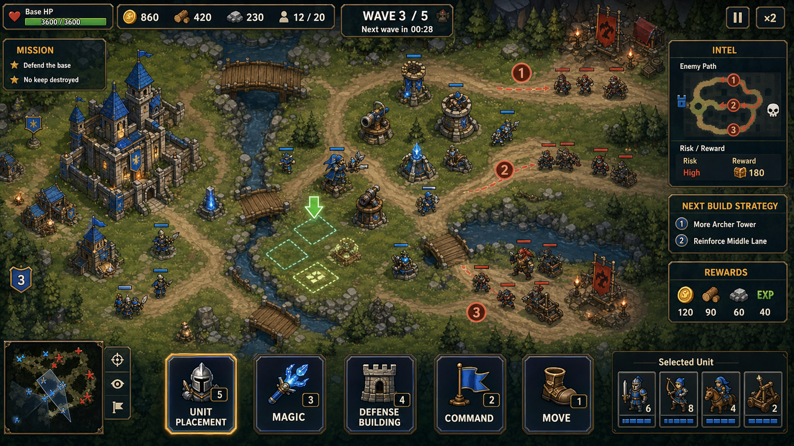

# MadDragon — Game Design Document

- 문서 유형: 게임 디자인 문서(GDD)
- 갱신일: 2026-09-11 KST
- 문서 버전: 2.0 (전면 재작성 — 코드/데이터 직접 조사 기반)
- 확인된 프로젝트 버전: **0.7.0** (근거: `ProjectSettings/ProjectSettings.asset`의 `bundleVersion: 0.7.0`, `visionOSbundleVersion`, `tvOSbundleVersion` 동일)
  - 참고: 루트의 실행파일명은 `MadDragon_v0.6.2_portable.exe`이며, `docs/MadDragon_기획서.md`의 2026-09-08 항목에 "v0.6.2의 게임 콘텐츠와 버전은 유지했다"는 기록이 있어 portable 배포 파일명이 프로젝트 버전(0.7.0)보다 갱신이 늦은 상태로 보인다. 두 버전 표기가 불일치하는 정확한 사유는 미확인.
  - Unity 에디터: `2022.3.62f3` (근거: `ProjectSettings/ProjectVersion.txt`)
  - Steam App ID: `480` (근거: `steam_appid.txt`) — 이는 Valve 공개 테스트용 App ID이며, `docs/steam-achievements.md`에도 "실제 Steamworks App ID로 교체 필요"라고 명시되어 있어 정식 스토어 등록 전 placeholder로 판단됨.
- 근거 신뢰도 정책: 이 문서의 모든 수치·해금조건·구현상태는 `Assets/_Game/Scripts`, `Assets/_Game/Tests`, `ProjectSettings`, `docs/*.md` 원문을 직접 열람해 확인했다. 코드/데이터에서 직접 확인되지 않은 항목은 전부 **"미확인"** 으로 표기했다(추측 금지).

## 0. 플레이 프리뷰



(추가 참고 이미지: `./MadDragon_01_플레이예시.png`, `./MadDragon_레퍼런스_플레이예시_구버전.png` — 모두 `docs/` 폴더에 실존하는 PNG. 기존 GDD(v1.0)에는 프리뷰 이미지 링크가 없었으므로 이번에 새로 추가했다.)

---

## 1. 기획 품질 6요소 요약

1. **핵심 재미가 무엇인가**: 병력/마법을 배치·투입하는 짧은 판단 → 실시간 전투 결과가 즉시 갱신 → 손실/보상을 바로 확인하고 다음 배치를 다시 짠다. "내 선택이 전투 결과로 즉시 되돌아오는" 인과 체감이 핵심 재미다.
2. **왜 재미있는가**: (a) 6종 유닛×5종 마법의 조합 실험이 있고, (b) 전투 결과 화면이 손실을 자원 단위로 분해해 알려줘 다음 선택의 근거가 명확해지며, (c) 공격/수비 두 모드가 있어 "내가 만든 진형을 내가 직접 공략해본다"는 자기 대결 구조가 존재한다(근거: `docs/MadDragon_기획서.md`).
3. **목표 플레이어층**: 기획서 원문 기준 "20~35세, Clash of Clans류 모바일 전략에 익숙하고 출퇴근/점심시간 5~15분 세션을 쓰는 코어 캐주얼 게이머"(근거: `docs/MadDragon_기획서.md` 페르소나 섹션). 코드에서 직접 확인되는 사실은 아니며 기획 문서 근거임을 명시.
4. **핵심 루프**: 상황 확인 → 배치/마법 선택(5개 이하 슬롯) → 실시간 전투 → 결과(자원 변화) 확인 → 다음 배치 준비. 이 루프는 `TestBootstrap.cs`의 Prep → Battle → Result 상태 전이와 `RaidResultSummaryModel`의 결과 문구 생성 흐름으로 코드상 확인된다.
5. **차별점**: (a) 같은 필드에서 공격 모드(적 성 공략, 3분 제한)와 수비 모드(5파 웨이브 방어)를 모드 토글 하나로 전환 가능(`TestBootstrap.ToggleMode`), (b) 안개 시스템(FOW)이 공격 모드에만 존재해 정보 비대칭을 만든다(`FogOfWarRoutine`, `EnsureFogVisualLayer`). CoC 대비 명확한 차별 훅은 `기획서.md` 자체에서도 "불충분"이라고 자평하고 있어(2026-07-01 평가), 차별점은 코드로는 확인되나 시장 임팩트는 미확인.
6. **리스크/도전과제**: (a) 실제 플레이 가능한 유일한 경로는 하드코딩된 `TestBootstrap.cs`(05_TestBattle 씬)이고, 데이터 기반 `StageData`/`CampaignManager` 시스템은 스테이지 에셋이 1개(`Stage01_Tutorial.asset`)뿐이라 병행 미완성 상태다. (b) Unity Test Runner가 XML 결과를 생성하지 못해 자동 테스트 리포트가 불완전하다는 기록이 반복적으로 남아 있다(`docs/next_improvement_instruction.md`, `docs/MadDragon_업데이트_내역서.md`). (c) Steam 통합은 App ID 480(placeholder) 상태로 정식 출시 전 단계다.

---

## 1-1. Problem Definition (문제 정의)

Clash of Clans류 모바일 전략을 즐기지만 출퇴근·점심시간처럼 5~15분 짧은 세션만 낼 수 있는 플레이어는, 배치 판단과 결과 피드백 사이의 인과관계가 느리거나 불명확한 게임에서 이탈하기 쉽다 **[제안, 기획서 페르소나 계승 — `docs/MadDragon_기획서.md` 페르소나 섹션 근거, §1-3에서 이미 인용]**. MadDragon은 배치 직후 실시간 전투 결과가 즉시 갱신되고, 결과 패널이 손실을 저장/지갑 자원 단위로 분해해 "다음에 무엇을 강화해야 하는지"를 문장으로 제시하는 방식으로 이 문제에 대응한다(`RaidResultSummaryModel.FormatHint`) **[사실, §6/§10에서 이미 확인]**. 다만 `기획서`의 2026-07-01 평가에서 "CoC류 경쟁작 대비 차별 훅이 불충분하다"고 자평했듯, 이 문제 해결 방식이 충분히 차별화됐는지는 시장 검증이 되지 않은 상태다 **[사실, 문서 근거, §14 알려진 리스크와 동일 근거]**.

## 2. 디자인 필러 (Design Pillars)

- **즉각적 인과**: 배치 직후 결과가 보이고, 결과 화면은 손실을 저장 자원/지갑 자원으로 분해해 알려준다(`RaidResultSummaryModel`, `RaidLossCalculator`).
- **짧은 선택, 긴 여운**: 슬롯 수를 제한(병력 로스터 6칸, 마법 5종 각 1충전)해 매 판 선택 부담을 낮추고 다음 판 전략을 남긴다.
- **공격과 수비의 대칭 구조**: 같은 유닛/건물 데이터로 공격(적 성 공략)과 수비(웨이브 방어) 양쪽을 플레이할 수 있다.
- **성장은 건물로 표현**: 특수 건물 6종(대장간/여인숙/훈련소/요새/금고/공방) 레벨업이 유닛 비용, 스탯, 건물 내구도, 자원 손실률, 해금을 직접 바꾼다(`BuildingEffectSystem`).

---

## 3. 구성요소

| 구성요소 | 역할 | 근거 파일 |
|---|---|---|
| 유닛(6종) | 플레이어가 배치하는 전투 개체. 근접/원거리/마법/속도/돌격/공성 역할 분담 | `Assets/_Game/Scripts/Testing/TestBootstrap.cs` (`Defs` 배열) |
| 특수 건물(6종) | 대장간/여인숙/훈련소/요새/금고/공방 — 레벨업으로 유닛·건물·자원 배율을 바꿈 | `Assets/_Game/Scripts/Buildings/BuildingEffectSystem.cs` |
| 마법(5종) | 전투 중 1회성 충전형 스킬(화염구/번개/치유/빙결/분노) | `Assets/_Game/Scripts/Battle/SpellSystem.cs` |
| 자원(3종) | Gold(골드), Honor(무공), Stars(별) | `Assets/_Game/Scripts/Economy/ResourceType.cs` |
| 레이드 결과(4종) | DefenseSuccess/NarrowFailure/ClearFailure/HeadquartersDestroyed | `Assets/_Game/Scripts/Economy/RaidOutcome.cs`, `RaidLossCalculator.cs` |
| 방어탑/성벽(수비 배치) | 준비 화면에서 골드로 구매해 진형을 짜는 방어 구조물 | `TestBootstrap._placeDefs` (방어탑 80골드, 성벽 20골드) |
| 데이터 기반 스테이지 시스템 | `StageData`/`CampaignManager`/`StarRatingSystem` — 별점 0~3, 해금 조건 보유 | `Assets/_Game/Scripts/Data/StageData.cs`, `Assets/_Game/Scripts/Campaign/*.cs` (스테이지 에셋은 1개만 존재, 병행 미완성) |

### 컴포넌트 표 (역할 / 선택 / 입력→판정→피드백 / 상태)

| 컴포넌트 | 역할 | 선택(플레이어 결정) | 입력 → 판정 → 피드백 | 상태 |
|---|---|---|---|---|
| 유닛 로스터 슬롯(6칸) | 전투에 투입할 병력 구성 | 6종 유닛 중 조합·수량 결정(골드 소모) | 구매 버튼 클릭 → 골드 차감(`_gold`) → 로스터 텍스트 갱신 | 구현됨 |
| 마법 슬롯(5종) | 전투 중 1회성 지원 스킬 | 화염구/번개/치유/빙결/분노 중 선택 장착 | 버튼 클릭 → `SpellSystem.TryBuy` → 충전 표시 갱신 | 구현됨 |
| 특수 건물 업그레이드(6종×Lv0~3) | 장기 성장 | 대장간/여인숙/훈련소/요새/금고/공방 중 업그레이드 순서 결정 | 업그레이드 버튼 → 비용 확인(`GetUpgradeCost`) → 배율 변화 즉시 적용 | 구현됨 |
| 공격/수비 모드 토글 | 같은 필드를 공격 또는 수비로 플레이 | 모드 전환 버튼 | 클릭 → `_defenseMode` 반전 → 준비 화면 UI 섹션 가시성 전환 | 구현됨 |
| 전투 중 선택(유닛 선택/이동/공격 명령) | 실시간 전술 지시 | 드래그 선택 → 우클릭 목적지/적 지정 | 입력 → `HandleInput` → 유닛 이동/공격 시작 | 구현됨 |
| 결과 패널 | 승패 및 손실/보상 요약 | (선택 없음, 확인 후 다음 판 준비로 복귀) | 전투 종료 → `RaidResultSummaryModel.Create` → 텍스트 표시 | 구현됨(영문 문구), 한국어 로컬라이즈는 별도 `RaidResultPanelText` 경로로 일부 적용(범위 미확인) |
| 캠페인 허브/스테이지 선택 | 장기 진행 구조 | 스테이지 선택 → 별점 확인 | 스테이지 클릭 → `IsStageUnlocked`(누적 별 ≥ 요구치) → 전투 진입 | 계획됨(에셋 1개만 존재, 실플레이 경로 아님) |

---

## 4. 콘텐츠 제공 방식 (해금 · 순서 · 보상 · 변형)

- **해금 순서(유닛)**: 유닛 인덱스 0~3(기사/궁수/마법사/정찰병)은 기본 해금. 인덱스 4(기병)는 여인숙(Tavern) 레벨 1 이상, 인덱스 5(공성기)는 여인숙 레벨 2 이상에서 해금된다(`BuildingEffectSystem.IsUnitUnlocked`). 코드 내 `UnitDef.valorToUnlock` 필드(기병=1, 공성기=2)가 별도로 정의되어 있으나, 이 필드를 직접 읽어 게이팅에 쓰는 코드는 확인되지 않았다 — 즉 "무공 포인트로 직접 해금"하는 보조 경로가 존재할 가능성이 있으나(`_unlocked` 해시셋과 무공 소모 코드가 별도로 존재) 정확한 무공 비용 수치는 **미확인**.
- **해금 순서(특수 건물)**: 대장간/여인숙/공방은 항상 개방. 훈련소·금고는 공방 레벨 1 이상, 요새는 공방 레벨 2 이상에서 해금(`BuildingEffectSystem.IsBuildingUnlocked`).
- **순서(전투 진행)**: 공격 모드는 준비 화면(로스터·마법 구성) → 3분(180초) 제한 전투(적 성 공략) 순서 고정. 수비 모드는 진형 구성(건물/유닛 배치) → 5파 웨이브 방어(1파는 5초 후, 2~5파는 25초 간격) → 전 파 격퇴 후 22초 생존 시 승리(`TestBootstrap.DefenseEnemyWaveRoutine`).
- **공급량(웨이브 유닛 수)**: 파수별 적 유닛 수 = `3 + 파수*2` → 1파 5기, 2파 7기, 3파 9기, 4파 11기, 5파 13기. 파수가 올라갈수록 등장 가능한 적 유닛 종류 상한도 확대(`Mathf.Min(wave, Defs.Length-1)`).
- **보상**: 전투 중 골드/무공 획득(`_earnedGold`, `_earnedValor`)과 건물 파괴 수(`_destroyedBuildings`)가 결과 패널에 집계된다. 정확한 보상 산식(적 처치당 골드량 등)은 이번 조사에서 발췌한 범위 밖에 있어 **미확인**(파일이 2,872줄로 방대해 전량 열람하지 못함).
- **변형(레이드 결과에 따른 손실률)**: 방어 성공 0%/0%, 근소한 실패(NarrowFailure) 저장자원 30%·지갑자원 5% 손실, 완전 돌파(ClearFailure) 저장자원 70%·지갑자원 15%, 본진 파괴(HeadquartersDestroyed) 저장자원 100%·지갑자원 20% 손실. 손실률은 본부(Headquarters) 보호율(레벨×10%, 최대 75%)만큼 추가로 경감되고, 금고(Treasury) 건물이 살아있으면 레벨에 따라 손실이 추가로 0~70% 더 감소한다(`RaidLossCalculator`, `BuildingEffectSystem.GetResourceLossMultiplier`).
- **자원 저장 상한(변형 요소)**: 본부 레벨 × 1000(골드), × 100(무공), 별(Stars)은 무제한(`ResourceStorageSystem.GetHeadquartersCapacity`).

---

## 5. 콘텐츠 개수/단위 — 코드로 확인된 값 vs 미확인

| 항목 | 값 | 상태 |
|---|---|---|
| 플레이 가능 유닛 종류 | 6종(기사/궁수/마법사/정찰병/기병/공성기) | 확인됨(`TestBootstrap.Defs`) |
| 특수 건물 종류 | 6종, 각 레벨 0~3(최대 3업그레이드) | 확인됨(`BuildingEffectSystem`) |
| 마법 종류 | 5종, 각 최대 충전 1 | 확인됨(`SpellSystem.Defs`) |
| 자원 종류 | 3종(Gold/Honor/Stars) | 확인됨(`ResourceType`) |
| 레이드 결과 등급 | 4종 | 확인됨(`RaidOutcome`) |
| 수비 웨이브 수 | 5파(공식 3+파수*2 유닛) | 확인됨(`TestBootstrap.DefenseEnemyWaveRoutine`) |
| 공격 모드 제한시간 | 180초 | 확인됨(`BattleTimeLimit`) |
| 데이터 기반 스테이지 수 | 1개(`Stage01_Tutorial.asset`)뿐 | 확인됨(에셋 존재 수), 콘텐츠로서 부족함은 별도 판단 |
| Steam 업적 | 14개, 통계(Stat) 6종 | 확인됨(`docs/steam-achievements.md`) — 실제 Steam 연동/실적은 미확인 |
| 전투 중 적 처치당 정확한 골드/무공 보상 산식 | — | 미확인(파일 용량상 미열람 구간 존재) |
| 유닛 해금에 필요한 정확한 "무공" 비용 수치 | — | 미확인(`valorToUnlock` 필드 정의만 확인, 소비 경로 불명확) |
| EditMode 테스트 실제 통과/실패 결과 | — | 미확인(XML 리포트 미생성 이력 반복 기록, `docs/next_improvement_instruction.md`) |

---

## 6. 재미 체인 (Fun Chain)

```
현재 자원/위험 확인
  → 유닛 6종·마법 5종 중 조합 선택(로스터 슬롯 최대 6칸, 마법 슬롯 최대 5칸)
  → 배치/투입 실행 (공격 모드: 진형 도열 후 진군 / 수비 모드: 건물·유닛 배치)
  → 실시간 전투 진행 (사거리·쿨다운·건물배율 등 스탯이 즉시 판정)
  → 승패 확정 (시간초과·전멸·성 파괴 등 종료 조건)
  → 결과 패널: 저장/지갑 자원 손실 또는 획득, "다음 행동 힌트" 텍스트 확인
  → 특수 건물 업그레이드나 유닛 조합을 바꿔 다음 판 준비로 복귀
```
이 체인은 `TestBootstrap`의 Prep→Battle→GameOver 상태 전이, `RaidLossCalculator`/`RaidResultSummaryModel`의 손실 계산·문구 생성 코드로 실제 구현이 확인된다.

---

## 7. Session (세션): 30초 / 5분 / 30분 / 장기 — 세션 관점별 서술

- **30초**: 준비 화면에서 로스터 슬롯 확인 → 유닛 1~2종 구매 → 출전 버튼. 코드상 로스터가 비어 있어도 공격 모드 진입 시 자동으로 기사 3기가 배정되어(`EnterBattle`의 `total==0` 폴백) 첫 진입 장벽을 낮춘다.
- **5분**: 공격 모드 1회 전투(최대 180초) + 결과 확인 + 다음 로스터 조정까지 한 사이클을 1~2회 반복 가능한 길이. 수비 모드는 1파(5초 대기) 시작부터 5파 처리 후 22초 생존까지 최소 약 5초+25초×4+22초 ≈ 127초 이상 소요되어 5분 세션 안에 1~2판이 들어간다(코드상 대기시간 합산; 실제 전투/이동 시간 포함 값은 미확인).
- **30분**: 공격/수비 모드를 번갈아 플레이하며 특수 건물 업그레이드 순서를 실험하는 구간. 대장간/훈련소/요새/금고 업그레이드 비용은 레벨당 100~700골드 사이로 설계되어 있어(`BuildingEffectSystem._costs`), 30분 세션 동안 1~2개 건물의 초기 레벨을 올리는 정도가 코드상 가능한 범위로 추정된다(정확한 골드 획득 속도 미확인이라 단정 불가).
- **장기(리텐션) 관점**: 코드에서 확인되는 장기 구조는 (a) 여인숙 레벨업을 통한 신규 유닛(기병/공성기) 해금, (b) 공방 레벨업을 통한 훈련소/금고/요새 해금(총 3단계 게이팅), (c) Steam 업적 14종 중 "50회 마법 시전", "100마리 처치", "20회 세션 완료" 등 장기 누적형 목표가 존재한다(`docs/steam-achievements.md`). 다만 일일/주간 순환 콘텐츠, 시즌 패스 등은 `기획서.md`의 "개선 제안" 섹션에 계획으로만 존재하며 코드 구현은 확인되지 않는다.

---

## 8. 구현됨 / 계획됨 / 제안 (3분류)

### 구현됨 (코드/데이터로 직접 확인)
- 6종 유닛 스탯표, 6종 특수 건물과 업그레이드 배율, 5종 마법(1충전), 3종 자원, 4종 레이드 결과와 손실률 계산.
- 공격 모드(180초 제한, FOW 안개 시스템, 초기 적 3파 형태 배치)와 수비 모드(5파 웨이브, 자동 성벽 생성, 문(Gate) 위치 이동) 두 플레이 경로.
- 결과 패널 텍스트 생성(`RaidResultSummaryModel`), 자원 저장/생산(`ResourceStorageSystem`, 8초당 골드 생산 GoldMine 1기 확인), 본부 보호율 및 금고 손실 경감.
- Steam 업적 14종/통계 6종 정의(연동 실적은 미확인).
- EditMode 단위 테스트 파일 다수 존재(`GridSystemTests`, `SaveSystemTests`, `StarRatingTests`, `ResourceStorageSystemTests`, `RaidLossCalculatorTests`, `CampaignHubScreenTests`, `RaidResultSummaryModelTests`, `RaidResultPanelTextTests`, `MobileBattleHudTests`, `ToonyRtsVisualLibraryTests`, `PlayableStartupTests` 등) — 존재는 확인되나 최근 실행 결과(pass/fail) 리포트는 미확인.

### 계획됨 (코드 골격은 있으나 콘텐츠/연결이 불완전)
- `StageData`/`CampaignManager`/`StarRatingSystem` 기반 정식 캠페인 진행 구조 — 스테이지 에셋이 `Stage01_Tutorial` 1개뿐이라 실질적으로 미완성이며, 실제 빌드의 첫 실행 씬은 이 시스템이 아니라 `05_TestBattle`(TestBootstrap) 경로로 고정되어 있다(`PlayableStartupTests`로 확인).
- 유닛 해금의 "무공(Honor) 소모 해금" 보조 경로로 보이는 `_unlocked` 해시셋과 비용 처리 코드가 존재하나, 정확한 비용·트리거는 미확인.
- Steam 정식 연동(App ID 480은 placeholder).

### 제안 (문서상 아이디어, 코드 근거 없음 — `기획서.md`의 "개선 제안" 섹션 인용)
- 웨이브 진입 경로 사전 표시(반투명 화살표), 패배 후 AI 힌트 문구, 기지 공략 히트맵, 도전 목표 보너스 보상, 조합별 승률 통계 화면.
- 시즌 패스/스타터 팩/보상형 광고 등 수익화 아이디어.
- 신규 적 유닛 2종, 비동기 PvP, 10~15스테이지 캠페인 등 콘텐츠 확장 로드맵.
- 웨이브 데이터 외부화(ScriptableObject/JSON), Analytics 연동, 순수 C# 전투 로직 분리 및 단위 테스트 확대.

---

## 9. 실제 플레이 예시 (코드/데이터 기반, 2건)

### 예시 A — 공격 모드 1판
1. 준비 화면: 골드 999,999(디버그용 무제한 골드, `_gold = 999999`)로 기사 2기(100골드) + 궁수 3기(105골드) + 마법사 1기(75골드) 구매, 화염구·번개 마법 장착.
2. 출전 → 4열 종대로 좌측 도열(`DeployArmy`), FOW가 활성화되어 시야 밖 적은 렌더러/콜라이더가 꺼져 보이지 않는다(`SpawnUnit`의 `!isPlayer && !_defenseMode` 분기).
3. 2초 후 적 1선(기사/궁수 랜덤 2종, 5기)이 등장, 이어서 2선(마법사~정찰병, 3기), 3선(기병~공성기, 3기)이 순차 배치된다(`SpawnInitialEnemyForce`).
4. 180초 이내에 적 성(HP 900)을 파괴하면 즉시 승리, 시간 초과 시 패배, 아군 전멸 시 즉시 패배.
5. 결과 패널: `RaidResultSummaryModel.Create`가 레이드 결과(예: NarrowFailure)에 따라 "Storage took the bigger hit. Upgrade Headquarters protection before the next raid." 같은 다음 행동 힌트를 표시.

### 예시 B — 수비 모드 5파 방어
1. 진형 구성: 방어탑(80골드)·성벽(20골드)을 배치하고, 문(Gate) 위치를 성벽 5칸 중 한 칸으로 지정(`MoveGate`).
2. 전투 시작 5초 후 1파(적 5기, 인덱스 0~0 즉 기사만) 등장. 이후 25초 간격으로 2파(7기, 0~1), 3파(9기, 0~2), 4파(11기, 0~3), 5파(13기, 0~4)가 순서대로 몰려온다.
3. 5파 처리 후 22초 동안 아군 성이 생존하면 "전 파 격퇴!" 승리 처리(`EndGame(true, "전 파 격퇴!")`).
4. 승리 시 `StarRatingSystem` 기준으로는(데이터 기반 스테이지 경로에 한해) 유닛 손실 0이면 +1성, 제한시간의 70% 이내 클리어 시 +1성이 추가되어 최대 3성 — 단, 이 별점 시스템은 `05_TestBattle`의 실제 플레이 경로와는 별도 시스템이라 이번 시나리오에 직접 연결되는지는 **미확인**.

---

## 10. 피로도 · 실패 완화 방안

- **초회 진입 장벽 완화**: 로스터가 비어 있으면 자동으로 기사 3기를 배정해 "빈손으로 시작"하는 상황을 방지한다(`EnterBattle`).
- **손실 상한**: 본부 보호율이 최대 75%까지 손실을 경감하고, 금고 건물이 생존해 있으면 레벨에 따라 손실을 추가로 최대 70% 더 줄인다 — 즉 최악의 경우에도 무한정 손실이 나지 않도록 이중 상한이 걸려 있다(`RaidLossCalculator`, `BuildingEffectSystem.GetResourceLossMultiplier`).
- **다음 행동 힌트**: 패배해도 결과 패널이 "무엇을 강화해야 하는지"를 문장으로 제시해 재도전 방향을 바로 알려준다(`RaidResultSummaryModel.FormatHint`).
- **문서상 제안(코드 미구현)**: 광고 시청 후 직전 파수부터 재시작, 패배 원인 AI 힌트 등은 `기획서.md`의 개선 제안 단계이며 코드로는 확인되지 않는다.

---

## 11. 경제 / 성장 / 밸런스

- **자원 3종**: Gold(전투/생산 획득, 유닛·건물 구매), Honor/무공(전투 중 획득, 특수 유닛 해금과 연관된 것으로 보이나 정확한 소비처는 일부 미확인), Stars(스테이지 시스템의 별점 자원으로 추정되나 이번 조사 범위에서 소비처 미확인).
- **생산**: 골드 광산(GoldMine) 1기가 초당 8골드를 생산하며 저장 한도 1200(`ResourceProductionBuilding("GoldMine", ResourceType.Gold, 8f, 1200)`), 이는 별도의 본부 레벨×1000 상한과 별개로 생산 건물 자체의 상한으로 추가 적용된다.
- **성장 축(특수 건물 6종, 레벨 0~3)**:
  - 대장간: 유닛 비용 −10/20/30%
  - 여인숙: 유닛 해금(기병 Lv1, 공성기 Lv2)
  - 훈련소: 유닛 데미지·HP +10/25/45%
  - 요새: 아군 건물 HP +20/40/70%
  - 금고: 자원 손실 −30/50/70%(단, 금고 건물이 생존해 있을 때만)
  - 공방: 훈련소/금고/요새 해금 게이트(공방 Lv1→훈련소·금고, Lv2→요새)
  - 업그레이드 비용은 건물별로 레벨당 100~700골드 사이(`_costs` 배열, 예: 대장간 100/200/350, 요새·공방 200/400/700).
- **밸런스 코멘트(문서 근거)**: `기획서.md`의 2026-07-01 평가에서 "유닛 수치가 기획서에 미기입 상태였다"는 지적이 있었으나, 이번 코드 조사로 `TestBootstrap.Defs`에 실제 수치가 존재함을 확인했다 — 다만 이 수치가 정식 밸런싱을 거쳤는지(플레이테스트 데이터 기반 조정 여부)는 미확인.

---

## 12. 온보딩 / UI·HUD 5가지 상태 / 접근성 / 오디오-비주얼

### 온보딩
- 로스터 비어있음 → 자동 기사 3기 배정(공격 모드 한정)으로 첫 진입 실패를 방지.
- 준비 화면에 캠페인 허브(`CampaignHubScreen`, Play/Prep/Base 3버튼)와 공격 준비 화면(`AttackPrepScreen`, 분대·마법·정보 요약 + Start/Army/Base/Hub 버튼)이 구현되어 있다.

### UI/HUD 5가지 상태 (로딩/빈 상태/에러/대량 데이터/긴 텍스트) — 코드 확인 범위
- 모바일 전투 HUD(`MobileBattleHud`)는 상단 상태바(남은시간/HP/획득자원)와 하단 4버튼 퀵바(Rally/Attack/Hold/Spells)로 구성되며, 명령 실행 시 상태 텍스트가 즉시 갱신된다("Rally point ready" 등) — 이는 "일반 상태" 피드백이 구현되어 있음을 보여준다.
- 로딩 화면, 빈 상태(유닛 미배치), 에러 처리, 대량 데이터(웨이브 100개 이상), 3배 긴 텍스트(다국어 확장) 각각에 대한 전용 화면/컴포넌트는 코드에서 별도로 확인되지 않았다 — **미확인**. `기획서.md`의 UX 원칙 섹션에 "로딩, 빈 상태, 에러, 많은 데이터, 긴 텍스트 상태를 각각 별도 화면/컴포넌트로 확인한다"는 원칙만 문서화되어 있고, 이를 검증하는 테스트나 화면은 이번 조사에서 발견하지 못했다.

### 접근성
- 코드에서 색맹 대응, 폰트 크기 조절, 터치 타깃 최소 크기 보장 로직은 확인되지 않았다 — **미확인**. `기획서.md`는 "주요 버튼 44px 이상, 화면당 CTA 강조색 1개, 선택지 5개 이하" 원칙을 문서화하고 있으나 코드 레벨 강제 장치(예: 버튼 최소 크기 검증 테스트)는 발견하지 못했다. `MobileBattleHud`의 버튼 크기는 132×58(가로×세로) 픽셀로 하드코딩되어 있어 44px 원칙과 방향은 일치하나 이를 검증하는 자동 테스트는 `MobileBattleHudTests.cs` 파일 존재만 확인, 세부 assert 내용은 미열람.

### 오디오/비주얼
- BGM: Kenney Music Loops CC0 OGG 루프 1곡. SFX: 자체 제작 CC0 WAV 6종(입력/액션/위험/전환/성공/실패 구분). 권장 믹스 BGM 0.28 / SFX 0.70(근거: `docs/MadDragon_기획서.md` 오디오 시스템 섹션, 2026-09-08 업데이트). 코드 내 재생 컴포넌트(`RuntimeAudioDirectorTests.cs` 테스트 존재)는 확인되나 이번 조사에서 소스 자체는 열람하지 않음.
- 비주얼: Toony RTS 3D 유닛/건물 모델을 우선 사용하고, 모델 로드 실패 시 생성 이미지 파사드(스프라이트)로 폴백하는 이중 렌더링 구조가 `TestBootstrap.ApplyBuildingVisual`/`ApplyToonyBuildingVisual`에서 확인된다. 공격 모드에는 안개(FOW) 비주얼 레이어(미탐색=짙은 안개, 탐색 후 시야 밖=옅은 안개)가 별도 구현되어 있다(`EnsureFogVisualLayer`).

---

## 13. 성공 KPI

문서(`docs/MadDragon_기획서.md`) 근거의 목표 수치이며, 실측 로그 연동은 코드에서 확인되지 않아 **목표치(미검증)** 로 표기한다.

| 지표 | 목표 수치 | 측정 방법(문서 기준) |
|---|---|---|
| 첫 세션 평균 플레이 시간 | 8분 이상 | 세션 로그 평균값 |
| 첫 세션 내 2회차 진입률 | 55% 이상 | 1판 완료 후 재시작 버튼 탭률 |
| D1 리텐션 | 30% 이상 | 설치 다음날 재접속 유저 비율 |
| 핵심 선택 화면 이탈률 | 15% 이하 | 배치 화면 이탈 로그 |
| 5파 생존 성공률(3판 이후) | 40% 이상 | 웨이브 완료 로그 |
| 3판 내 상이한 빌드 선택률 | 50% 이상 | 유닛 조합 다양성 로그 |

실측 로그 수집 파이프라인(Analytics 연동 등)은 `기획서.md`의 "기술적 개선" 제안 항목으로만 존재하며 코드 구현은 **미확인**.

---

## 14. 알려진 리스크

- 실제 플레이 경로(`05_TestBattle`/`TestBootstrap.cs`, 2,872줄)와 데이터 기반 스테이지 시스템(`StageData`/`CampaignManager`)이 이원화되어 있어, 콘텐츠 확장 시 어느 경로를 정식으로 삼을지 결정이 필요하다.
- Unity Test Runner의 XML 결과 미생성 문제가 여러 차례(2026-07-02~07-03) 기록되어 있어, 회귀 검증 자동화가 아직 불완전하다.
- 버전 표기 불일치(ProjectSettings 0.7.0 vs portable exe 파일명 v0.6.2)를 해결하지 않으면 배포물 추적에 혼선이 생길 수 있다.
- Steam App ID가 placeholder(480)로 남아 있어 정식 출시 전 반드시 교체가 필요하다.
- CoC류 경쟁작 대비 차별점이 기획 문서 자체에서 "불충분"으로 자평된 상태(2026-07-01 평가, 종합 5.5/10, 보류)이며, 재착수 조건(유닛 스탯 확정·차별 훅 구체화·빌드 환경 정상화)의 이행 여부는 코드상 유닛 스탯은 확인되었으나 나머지 조건의 완료 여부는 미확인.

---

## 15. 다음 우선순위

1. 버전 표기 통일: `ProjectSettings.asset`의 0.7.0과 portable exe 파일명(v0.6.2)을 일치시키거나, 불일치 사유를 문서에 명시한다.
2. `TestBootstrap.cs`(실제 플레이 경로)와 `StageData`/`CampaignManager`(데이터 기반 경로) 중 정식 콘텐츠 파이프라인을 결정하고, 필요 시 `StageData` 자산을 실제 웨이브 구성과 동기화한다.
3. 적 처치/웨이브 클리어당 정확한 골드·무공 보상 산식과, 유닛 해금에 필요한 정확한 무공 비용을 코드에서 재확인해 이번 문서의 "미확인" 항목을 줄인다.
4. Unity Test Runner XML 미생성 문제의 근본 원인을 분리하고, EditMode 테스트의 실제 통과/실패 리포트를 확보해 구현 상태 신뢰도를 높인다.
5. Steam App ID를 정식 값으로 교체하고, 접근성(버튼 최소 크기, 색맹 대응)·5가지 UI 상태(로딩/빈 상태/에러/대량 데이터/긴 텍스트)에 대한 코드 레벨 검증(테스트 또는 전용 컴포넌트)을 추가한다.

---

## 16. 근거 노트 (Evidence Note)

이 문서 작성에 직접 근거로 사용한 파일 목록:

- 버전/빌드: `ProjectSettings/ProjectSettings.asset`(bundleVersion), `ProjectSettings/ProjectVersion.txt`(Unity 에디터 버전), `steam_appid.txt`
- 규칙: `AGENTS.md`(빌드/배치 규칙)
- 기획 문서: `docs/MadDragon_기획서.md`(v0.4, 페르소나·KPI·개선 제안·평가 이력 포함), `docs/MadDragon_업데이트_내역서.md`, `docs/next_improvement_instruction.md`, `docs/persona_playtest_feedback.md`, `docs/MadDragon_이미지_UI_리소스_목록.md`, `docs/steam-achievements.md`
- 이전 GDD(v1.0, 이번에 교체됨): `docs/MadDragon_GDD.md`(교체 전 원문 — 전량 [사실]/[제안] 태깅 구조였고 수치는 대부분 [제안]이었음. 이번 재작성에서 실제 코드 확인을 통해 다수 항목을 [사실]로 승격했다.)
- 핵심 게임플레이 코드: `Assets/_Game/Scripts/Testing/TestBootstrap.cs`(유닛 스탯, 웨이브 구성, 모드 전환, FOW), `Assets/_Game/Scripts/Buildings/BuildingEffectSystem.cs`(특수 건물 6종), `Assets/_Game/Scripts/Battle/SpellSystem.cs`(마법 5종), `Assets/_Game/Scripts/Battle/AIWaveSpawner.cs`, `Assets/_Game/Scripts/Economy/ResourceType.cs`, `RaidOutcome.cs`, `RaidLossCalculator.cs`, `RaidResultSummaryModel.cs`, `ResourceStorageSystem.cs`, `Assets/_Game/Scripts/Data/UnitData.cs`, `BuildingData.cs`, `StageData.cs`, `Assets/_Game/Scripts/Campaign/CampaignManager.cs`, `StarRatingSystem.cs`, `Assets/_Game/Scripts/UI/MobileBattleHud.cs`, `CampaignHubScreen.cs`, `AttackPrepScreen.cs`
- 테스트: `Assets/_Game/Tests/EditMode/PlayableStartupTests.cs`(실제 빌드 첫 씬이 `05_TestBattle`임을 확인), 그 외 `GridSystemTests.cs`, `SaveSystemTests.cs`, `StarRatingTests.cs`, `ResourceStorageSystemTests.cs`, `RaidLossCalculatorTests.cs`, `CampaignHubScreenTests.cs`, `RaidResultSummaryModelTests.cs`, `RaidResultPanelTextTests.cs`, `MobileBattleHudTests.cs`, `ToonyRtsVisualLibraryTests.cs`, `GeneratedArtLibraryTests.cs`, `Assets/Tests/EditMode/RuntimeAudioDirectorTests.cs`(존재 확인, 내용 상세 열람은 일부만 수행)
- 데이터 에셋: `Assets/_Game/ScriptableObjects/Units/*.asset`(5개), `Buildings/*.asset`(6개), `Stages/Stage01_Tutorial.asset`(1개만 존재)
- 이미지: `docs/MadDragon_gameplay_preview.png`, `docs/MadDragon_01_플레이예시.png`, `docs/MadDragon_레퍼런스_플레이예시_구버전.png`(모두 실존 확인, 이번 문서 상단에 상대경로로 임베드)

이번 조사에서 다루지 못한 부분: `TestBootstrap.cs`는 총 2,872줄 중 앞부분(약 1,113줄)만 상세 열람했고, 나머지(전투 판정 세부, 정확한 보상 산식, UI 나머지 절반)는 발췌 확인 수준이라 이 문서의 "미확인" 표기 다수가 이 범위에 해당한다. 후속 조사 시 해당 파일의 나머지 구간(offset 1114 이후)을 우선 확인할 것을 권장한다.
