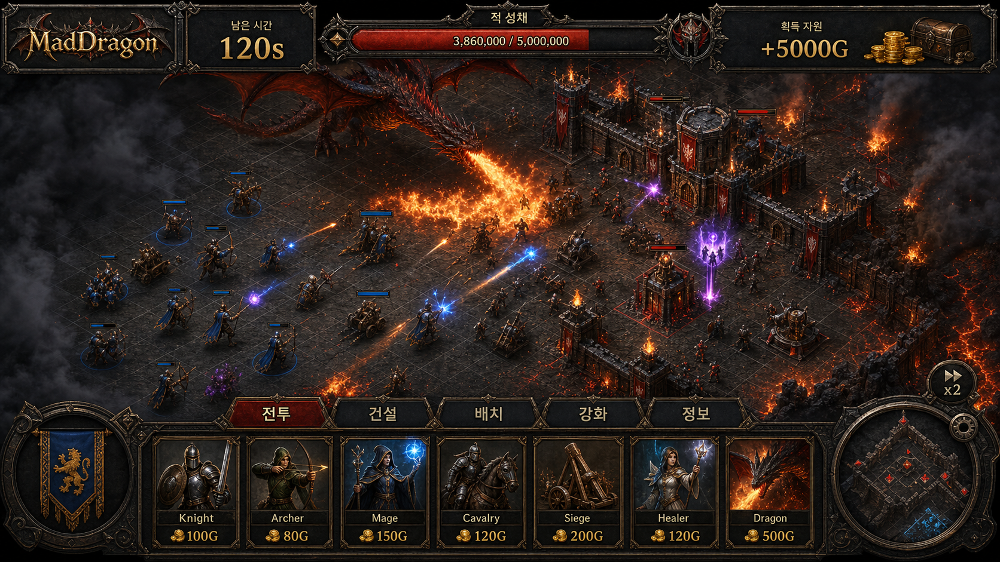

# MadDragon 기획서

**버전:** v0.5 draft
**최신화:** 2026-05-15
**방향:** 모바일 우선 공방 순환 RTS


---

## 플레이 미리보기

### 플레이 미리보기


---
## 핵심 콘셉트

MadDragon은 공격과 방어가 번갈아 성장하는 모바일 RTS 캠페인이다.

플레이어는 적 요새를 공격해 자원을 벌고, 본부와 방어 시설을 강화하며, 자동 생산되는 자원을 수거하고, 침공 방어에 실패하면 자원을 약탈당한다. 핵심 재미는 전투 조작만이 아니라 "언제 공격하고, 언제 수거하고, 어디에 방어 투자를 할지"를 판단하는 데 있다.

## 핵심 루프

```text
캠페인 허브
-> 공격 준비
-> 요새 공격
-> 보상 정산
-> 기지 정비
-> 침공 방어 또는 다음 공격
```

## 공격

공격은 상대 요새를 뚫는 퍼즐이다.

- 정찰로 적 방어 배치와 약점을 확인한다.
- 제한된 병력 슬롯과 장착 마법을 구성한다.
- 전투 중에는 전장 터치, 집결, 공격, 후퇴/대기, 마법 사용에 집중한다.
- 승리하면 골드, 명예, 별, 해금 보상을 얻는다.

## 방어

방어는 플레이어 경제를 지키는 성장판이다.

- 본부, 성벽, 타워, 특수 건물, 주둔 병력으로 방어선을 만든다.
- 침공 예고는 주요 위협을 알려준다.
- 방어에 성공하면 자원을 지키고 방어 보상을 얻는다.
- 방어에 실패하면 미수거 자원과 보유 자원의 일부를 약탈당한다.

## 자원 생산과 약탈

대부분의 생산 건물은 시간이 지나며 자원을 만든다. 본부는 생산된 자원을 저장하고, 본부 레벨은 저장량과 보호율을 높인다.

자원 상태는 두 가지로 나눈다.

- 미수거/저장 자원: 건물이나 본부에 쌓인 자원.
- 보유 자원: 이미 플레이어 지갑에 들어온 자원.

방어 실패 시 약탈 대상은 둘 다 포함한다.

```text
방어 성공: 손실 없음, 방어 보상 획득
아슬아슬한 실패: 미수거 자원 30%, 보유 자원 5% 손실
완전 패배: 미수거 자원 70%, 보유 자원 15% 손실
본부 파괴: 미수거 자원 100%, 보유 자원 20% 손실
```

수치는 밸런싱 대상이며, UI에는 항상 예상 약탈량과 보호율을 표시한다.

```text
예상 약탈: 저장 골드 1,200 중 840 / 보유 골드 8,000 중 400
보호율: 35%
위험도: 높음
```

## 자원 역할

- 골드: 병력, 마법, 건물 배치, 수리 등 즉시 소비.
- 명예: 유닛 해금, 특수 건물 업그레이드, 패시브 성장.
- 별: 캠페인 진행도와 보상 해금 조건.

## 모바일 레이아웃 원칙

전장은 최대한 넓게 보여주고, UI는 필요한 순간에만 하단 시트로 연다.

- 상단 바: 시간, 목표 HP, 자원, 위험도처럼 핵심 상태만 표시.
- 하단 탭: 병력, 마법, 정보, 건설, 주둔, 강화처럼 화면별 작업 전환.
- 하단 시트: 구매, 상세 정보, 배치, 업그레이드.
- 전투 퀵바: 선택 병력, 집결, 공격, 후퇴/대기, 장착 마법.
- 한 화면에는 하나의 주요 행동만 크게 표시한다.

## 화면 구성

### 캠페인 허브

- 상단: 챕터, 골드, 명예, 별, 저장 자원, 침공 위험도.
- 중앙: 스테이지 노드 또는 카드.
- 하단: 공격, 기지, 업그레이드 탭.
- 주요 CTA: 다음 공격 또는 기지 수거/정비.

### 공격 준비

- 하단 탭: 병력, 마법, 정보.
- 병력은 구매 버튼 나열보다 출전 슬롯/분대 구성으로 표현한다.
- 마법은 전투에 장착할 2~3개만 고르게 한다.
- 정보 탭은 적 방어와 추천 대응을 요약한다.

### 요새 공격

- 상단: 남은 시간, 목표 HP, 획득 자원.
- 하단: 선택 병력, 집결, 공격, 후퇴/대기, 마법.
- 라인 선택은 버튼보다 전장 터치로 해결한다.

### 기지 정비

- 상단: 저장 자원, 보유 자원, 저장 한도, 예상 약탈량.
- 하단 탭: 수거, 건설, 주둔, 강화.
- 주요 행동: 모두 수거, 수리, 본부 강화, 보호율 강화.

### 침공 방어

- 상단: 본부 HP, 침공 타이머, 보호 자원.
- 하단: 주둔 병력, 집결, 집중 공격, 방어 마법.
- 결과 화면은 지킨 자원과 잃은 자원을 명확히 보여준다.

### 결과

- 승패, 별, 획득/약탈 자원, 해금, 보호 결과를 표시한다.
- 공격 후 주요 CTA는 기지 정비.
- 방어 실패 후 주요 CTA는 수리 및 보강.

## 구현 상태

### v0.5 구현 요약

- 자원 생산 건물, 본부 저장, 모두 수거, 본부 보호율을 구현했다.
- 방어 실패 단계에 따라 미수거 자원과 보유 자원의 예상 약탈량을 계산한다.
- 캠페인 허브, 기지 정비, 공격 준비, 전투 HUD의 모바일 우선 프로토타입 화면을 추가했다.
- Clash-like 비주얼 방향을 위해 카메라, 조명, 진영 색상, 지형/석재/골드 팔레트를 공통 스타일로 분리했다.

### v0.5 Task 1 - 자원 생산/저장 로직

- `ResourceWallet`로 골드, 명예, 별 같은 자원을 보관하고 추가/소비/제거/복사할 수 있게 했다.
- `ResourceProductionBuilding`으로 생산 건물의 초당 생산량과 개별 저장 한도를 표현한다.
- `ResourceStorageSystem`으로 본부 레벨, 저장 자원, 생산 누적, 모두 수거, 본부 저장 한도, 보호율을 계산한다.
- 같은 자원을 생산하는 건물이 여러 개 있을 때 개별 건물 한도가 아니라 자원별 총 생산 한도와 본부 저장 한도를 함께 적용한다.
- EditMode 테스트에 생산 누적, 생산 건물 한도, 다중 생산 건물 총량, 본부 저장 한도, 모두 수거, 보호율 상한, 본부 레벨 최소값, null 생산 건물 방어 케이스를 추가했다.

### v0.5 Task 2 - 약탈 손실 계산

- `RaidLossCalculator`로 방어 결과별 예상 약탈 손실과 실제 자원 차감을 계산한다.
- 보호율은 0%~75% 범위로 보정하고, 예측 결과에도 보정된 보호율을 표시한다.
- 골드, 명예, 별 모두에 저장 자원 손실과 보유 자원 손실을 동일한 규칙으로 적용한다.

### v0.5 Task 3 - 세이브 데이터 통합

- `SaveData`에 보유 자원, 저장 자원, 본부 레벨, 마지막 수거 시각을 저장하는 경제 상태 필드를 추가했다.
- `SaveSystem.Load`는 오래된 세이브의 null 딕셔너리/지갑과 지갑 내부 수량 딕셔너리를 기본값으로 보정하고, 본부 레벨이 0 이하이면 1로 복구한다.
- EditMode 테스트에 저장 후 불러오기에서 보유/저장 골드, 명예, 별, 본부 레벨, 마지막 수거 시각이 유지되고 오래된 경제 필드가 기본값으로 보정되는 케이스를 추가했다.

### v0.5 Task 4 - 모바일 UI 기반

- `MobileHudTheme`에 모바일 HUD 패널, 강조 패널, 골드/명예/위험/긍정 색상, 주요/보조 버튼 색상, 폰트 크기, 하단 시트 높이, 주요 버튼 크기 상수를 추가했다.
- `MobileUiFactory`로 UGUI 패널, 라벨, 버튼 생성과 `RectTransform` 배치를 재사용할 수 있게 분리했다.

### v0.5 Task 5 - 캠페인 허브/기지 정비 프로토타입

- `CampaignHubScreen`으로 보유 자원, 저장 자원, 예상 약탈 손실을 첫 화면에서 확인하고 `Play`로 즉시 전투를 시작하거나 `Prep`/`Base`로 준비와 기지 정비를 선택할 수 있게 했다.
- `BaseManagementScreen`으로 본부 레벨, 저장 한도, 저장 골드, 예상 손실을 표시하고 `Collect` 버튼으로 미수거 자원을 보유 자원으로 옮길 수 있게 했다.
- `TestBootstrap`에 자원 생산 틱, 현재 약탈 예측, 허브의 즉시 전투 시작, 기지/기존 공격 준비 화면 전환을 연결해 자동 생산 자원을 자주 챙기는 루프를 프로토타입 화면에 반영했다.
- 기존 공격 준비 화면에서도 `Hub`/`Base` 버튼으로 돌아갈 수 있어, 병력 구매 전후에 저장 자원 수거와 약탈 위험 확인을 다시 할 수 있다.

### v0.5 Task 6 - 공격 준비 화면

- `AttackPrepScreen`으로 편성 병력, 마법 슬롯, 정찰 정보를 한 화면에 요약해 출전 직전 확인 흐름을 추가했다.
- `Army` 버튼은 기존 병력/마법 구매 화면으로 이어지고, `Start`는 기존 전투 진입 로직을 호출해 현재 프로토타입 전투 흐름을 유지한다.
- 공격 준비 화면에서도 `Hub`와 `Base`로 돌아갈 수 있어, 출전 직전에 저장 자원 수거와 약탈 위험 확인을 반복할 수 있다.
- 테스트 편의를 위해 공격 병력이 비어 있을 때 허브의 `Play` 또는 공격 준비 화면의 `Start`를 누르면 기본 기사 3명을 자동 편성하고 전투를 시작한다.

### v0.5 Task 7 - 모바일 전투 HUD

- `MobileBattleHud`를 추가해 전투 중 남은 시간, 목표 HP, 획득 골드/명예를 상단에 압축 표시한다.
- 하단 퀵바는 집결, 공격, 대기, 마법 같은 모바일 전투 명령 위치를 먼저 잡아두는 프로토타입 UI로 연결했다.
- 기존 전투 HUD는 아직 유지해 입력 기능을 보존하고, 새 HUD는 다음 단계에서 점진적으로 주 HUD가 되도록 병행 표시한다.

### v0.5 Task 8 - 모바일 비주얼 스타일 기반

- `MobileVisualStyle`로 카메라, 조명, 하늘색, 잔디, 진영 색상, 석재, 골드 포인트 색상을 한곳에서 관리한다.
- 프로토타입 월드의 카메라 시야각과 조명을 모바일에서 읽기 쉬운 밝고 장난감 같은 톤으로 조정했다.
- 적 건물, 플레이어 건물, 성벽, 게이트, 지면 색상을 공통 팔레트로 연결해 이후 Clash-like 퀄리티 업그레이드의 기준점을 만들었다.
- 밝은 레퍼런스 이미지 방향에 맞춰 잔디/길/돌/목재/횃불 팔레트를 보강하고, 성/타워/마법탑/자원 건물에 지붕, 금색 트림, 문, 배너, 광원 장식을 추가했다.
- 전장 가장자리에 나무와 바위 클러스터를 배치하고 중앙 경로를 추가해 평면 primitive 전장이 모바일 전략 게임처럼 읽히도록 밀도를 높였다.
- 생성 이미지 리소스를 `Resources/MadDragonArt`로 분할 배치하고, 월드 건물 파사드와 병력/마법 구매 버튼 썸네일에 실제로 연결했다.
- Asset Store의 `Natural Environment (Mobile)` 방향을 검토했으며, 에셋스토어 인증 다운로드 전까지 프로젝트 내 `SimpleNaturePack`/절차적 장식으로 숲 가장자리, 풀밭, 바위, 꽃, 물길, 배경 능선을 전장에 적용했다.
- 배경 장식은 충돌체를 제거한 비전투 오브젝트로 구성해 유닛 이동, 공격 판정, 플레이 버튼 전투 진입 안정성에 영향을 주지 않도록 했다.
- 포터블 실행 시 구형 `01_MainMenu`의 미연결 버튼으로 시작하던 문제를 수정해, 빌드 첫 씬을 최신 캠페인 허브/전투 루프가 붙은 `05_TestBattle`로 변경했다.
- `GameManager`의 씬 전환명도 실제 빌드 씬 파일명(`01_MainMenu`, `02_BaseBuilder`, `05_TestBattle`, `04_Result`)에 맞춰 수정했다.

## 구현 방향

1차 구현은 현재 프로토타입 기능을 살리되 모바일 UI 구조로 재배치한다.

권장 분리 단위:

- `CampaignHubScreen`
- `AttackPrepScreen`
- `BattleHud`
- `BaseManagementScreen`
- `DefenseSetupHud`
- `ResultScreen`
- `ResourceStorageSystem`
- `RaidLossCalculator`

`TestBootstrap.cs`는 한 차례 더 통합 테스트 하네스로 유지할 수 있지만, 자원 저장/약탈 계산과 UI 화면 생성은 별도 클래스로 분리한다.

## 검증

로직 검증:

- 자원 생산 누적.
- 모두 수거.
- 본부 저장 한도.
- 약탈 손실 계산.
- 보호율 보정.
- 별/보상 계산.
- 해금 조건.

화면 검증:

- 모바일 세로/가로 비율.
- 터치 영역 크기.
- 텍스트 겹침 없음.
- 하단 시트가 열려도 전장 핵심 정보가 보이는지 확인.

<!-- APPLIED_RESOURCES_START -->
## 적용 리소스

> 자동 갱신: 2026-06-04. 코드, 씬, 프리팹, 설정 파일에서 참조가 확인된 리소스 기준입니다.

- 이미지/스프라이트: `Assets/SimpleNaturePack/Textures/NaturePackLite_Texture_01.png`
- Unity/프리팹: `Assets/_Game/Materials/Archer_Mat.mat`, `Assets/_Game/Materials/ArcherTower_Mat.mat`, `Assets/_Game/Materials/Barracks_Mat.mat`, `Assets/_Game/Materials/CannonTower_Mat.mat`, `Assets/_Game/Materials/Castle_Mat.mat`, `Assets/_Game/Materials/Catapult_Mat.mat`, `Assets/_Game/Materials/GoldMine_Mat.mat`, `Assets/_Game/Materials/Mage_Mat.mat`, `Assets/_Game/Materials/Scout_Mat.mat`, `Assets/_Game/Materials/Wall_Mat.mat`, `Assets/_Game/Prefabs/Buildings/ArcherTower.prefab`, `Assets/_Game/Prefabs/Buildings/Barracks.prefab` 외 52개

메모:
- 리소스 후보 116개 중 자동 참조 확인 65개.
<!-- APPLIED_RESOURCES_END -->

<!-- RESOURCE_PREVIEWS_START -->
## 공유용 이미지 미리보기

> 자동 갱신: 2026-06-04. 공유 시 문서와 함께 아래 이미지 경로가 포함되어야 합니다.


- `Assets/SimpleNaturePack/Textures/NaturePackLite_Texture_01.png`

<!-- RESOURCE_PREVIEWS_END -->
